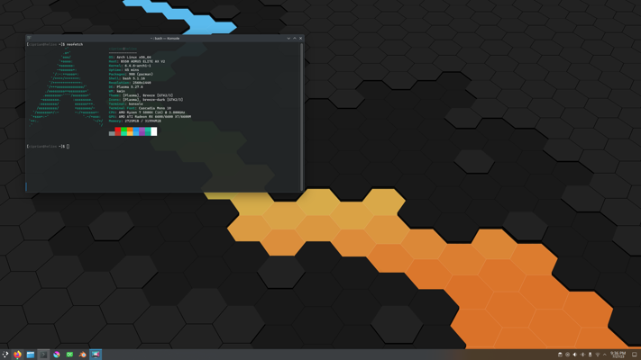

# Arch Linux with KDE plasma



My personal Arch Linux and KDE Plasma installation.

**Disclaimer:** This is not a beginner guide, please read the official [Arch Linux installation guide](https://wiki.archlinux.org/title/Installation_guide)

## Create a Bootable USB flash drive
Download the latest Arch Linux ISO for x86_64 platform from [Arch Linux Downloads](https://archlinux.org/download/)

Write the ISO image to the USB flash drive using [balenaEtcher](https://etcher.balena.io/)

**Optional:** On Linux `dd` command can be used instead of **balenaEtcher**, first identify the USB flash drive path:
```bash
[user@hostname ~]$ lsblk
NAME        MAJ:MIN RM   SIZE RO TYPE MOUNTPOINTS
sda           8:0    1  28.9G  0 disk 
└─sda1        8:3    1  28.9G  0 part 
nvme1n1     259:0    0 931.5G  0 disk 
├─nvme1n1p1 259:2    0     1G  0 part /boot/efi
└─nvme1n1p2 259:3    0 930.5G  0 part /
nvme0n1     259:1    0 931.5G  0 disk 
└─nvme0n1p1 259:4    0 931.5G  0 part /mnt/storage
```
Write the ISO image:
```bash
sudo dd if=archlinux-2023.07.01-x86_64.iso of=/dev/sda bs=1M status=progress
```

## Boot from Arch flash drive
While PC is booting hit **F12** and select the Arch flash drive from the boot menu

## Connect to the internet
If you are using an ethernet connection just make sure the ethernet cable is connected and use `ip link` to check if the interface has an IP address.

On WiFi use `iwctl` to connect to your WiFi network.

Test the internet connection by pinging a known server, example
```bash
root@archiso ~ # ping -c 5 8.8.8.8
PING 8.8.8.8 (8.8.8.8) 56(84) bytes of data.
64 bytes from 8.8.8.8: icmp_seq=1 ttl=58 time=17.4 ms
64 bytes from 8.8.8.8: icmp_seq=2 ttl=58 time=17.2 ms
64 bytes from 8.8.8.8: icmp_seq=3 ttl=58 time=17.3 ms
64 bytes from 8.8.8.8: icmp_seq=4 ttl=58 time=17.2 ms
64 bytes from 8.8.8.8: icmp_seq=5 ttl=58 time=17.2 ms

--- 8.8.8.8 ping statistics ---
5 packets transmitted, 5 received, 0% packet loss, time 4005ms
rtt min/avg/max/mdev = 17.150/17.262/17.400/0.092 ms
```

## Partition the disks
Use `fdisk` to create a new GPT partition table
```bash
fdisk /dev/nvme0n1
```
Then create the following partitions:
```bash
root@archiso ~ # lsblk
NAME        MAJ:MIN RM   SIZE RO TYPE MOUNTPOINTS
nvme0n1     259:0    0 932.0G  0 disk 
├─nvme0n1p1 259:2    0     1G  0 part
├─nvme0n1p2 259:2    0 128.0G  0 part
└─nvme0n1p3 259:3    0 803.0G  0 part
```
Create the EFI file system
```bash
mkfs.fat -F32 /dev/nvme0n1p1
```

Create the `ext4` Linux file system on the rest
```bash
mkfs.ext4 /dev/nvme0n1p2
mkfs.ext4 /dev/nvme0n1p3
```

Mount partitions to `/mnt`
```bash
mount /dev/nvme0n1p2 /mnt

mkdir -p /mnt/boot/efi
mkdir /mnt/home

mount /dev/nvme0n1p1 /mnt/boot/efi
mount /dev/nvme0n1p3 /mnt/home
```

**Optional:** If you have other SSD drives create partitions and Linux file system for them or just mount them if they are already partitioned.
```bash
mkdir /mnt/storage
mount /dev/nvme1n1p1 /mnt/storage
```

## Install essential packages
Use `pacstrap` to install the base system and Linux kernel
```bash
pacstrap -K /mnt base base-devel linux linux-headers linux-firmware amd-ucode
```

## Generate fstab
Generate the Linux file system table, use `-U` parameter to identify partitions by their UUID
```bash
genfstab -U /mnt >> /mnt/etc/fstab
```
